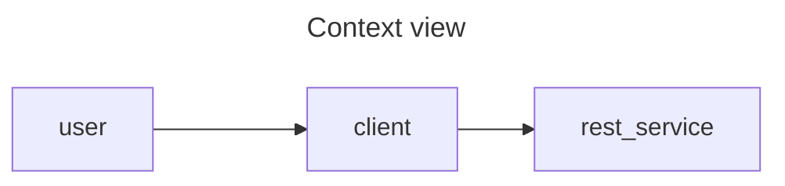
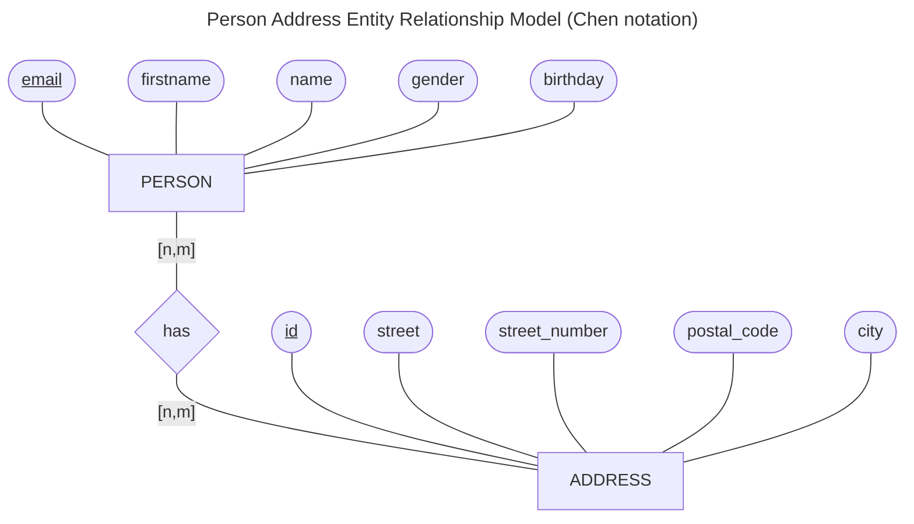
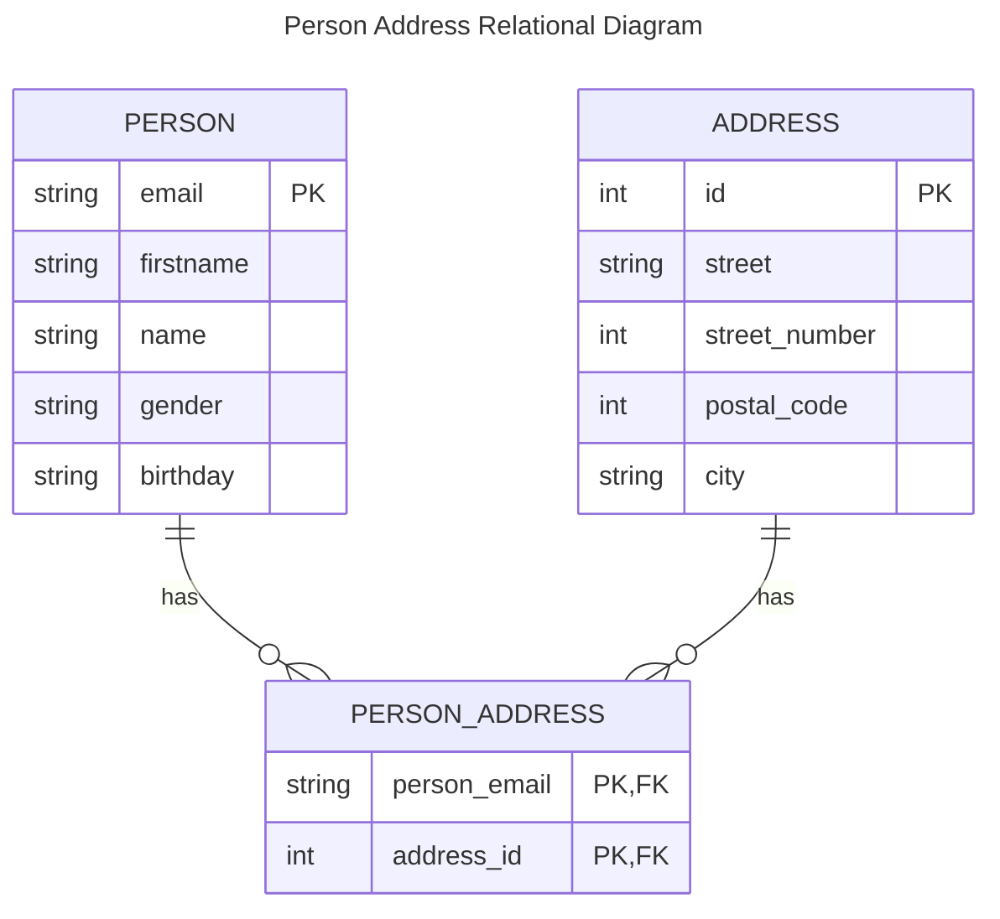

# Architecture Notes

Some notes about the design process and visuals to aid talking points for the demo application.

## Quality requirements

| Id | Scenario                                                                                                                                     |
|----|----------------------------------------------------------------------------------------------------------------------------------------------|
| 1  | As a customer, I want to persist persons and addresses, so I can validate and manage addresses.                                              |
| 2  | As a API user, I want to call the RESTful endpoints with CRUD operations, so I can establish data consistency and integrity.                 |
| 3  | As a customer, I want to list all persons by address, so I can optimize the delivery processes.                                              |
| 4  | As a customer, I want to calculate the average age of all persons by postal code, so I can use the age demographics for marekting campaigns. |

## Context and Scope

## Solution strategy

## Building Block Level 1

## Crosscutting concepts

